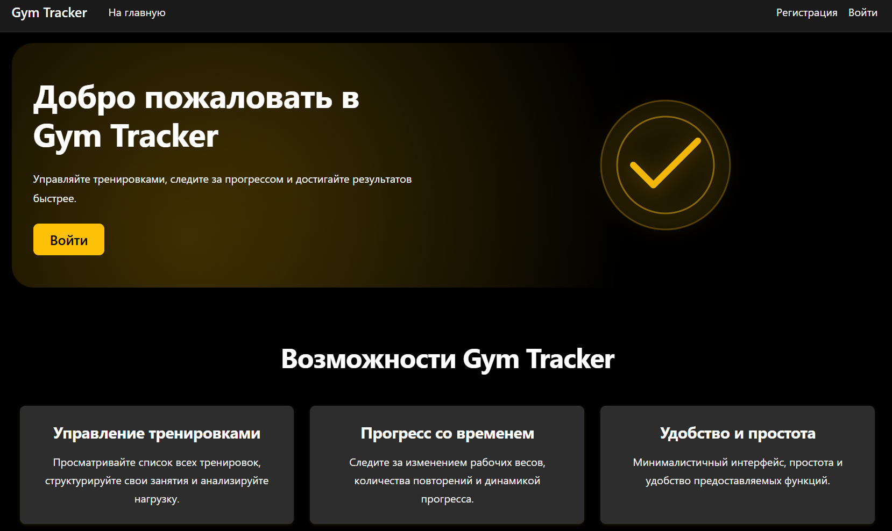

# GymTrackerProject

GymTrackerProject - это веб-приложение для ведения тренировок и отслеживания спортивного прогресса. Идея проекта строится вокруг понятного сценария: пользователь создает тренировки, добавляет в них упражнения, фиксирует подходы, вес и повторения, а затем наблюдает, как меняются его результаты со временем.

Этот проект важен не только как полезный фитнес-инструмент, но и как демонстрация инженерного подхода к разработке. Здесь реализованы аутентификация, работа с пользовательскими данными, архитектурное разделение логики, реляционная модель данных, контейнеризация и база для дальнейшего масштабирования продукта. Проект задуман как фундамент для будущей платформы, в которую можно добавить аналитику прогресса, рекомендации и CV-анализ техники выполнения упражнений.

## Основные возможности

- полноценная аутентификация, реализованная при помощи библиотеки Identity
- ведение персонального списка тренировок
- создание, переименование и удаление тренировок
- добавление упражнений в тренировку
- добавление подходов с весом и количеством повторений
- редактирование и удаление записей прогресса
- запуск приложения и базы данных через Docker Compose

## Технологический стек

- ASP.NET Core 10 Razor Pages
- Entity Framework Core 10
- PostgreSQL
- ASP.NET Core Identity
- MediatR
- Bootstrap
- Docker и Docker Compose

## Скриншоты

### Главная страница




## Архитектура проекта

Проект организован в стиле чистой архитектуру с идеей разделения приложения на определённые функциональные блоки, чтобы код было проще поддерживать и расширять:

- `Pages/` - пользовательский интерфейс на Razor Pages
- `Data/` - `ApplicationDbContext` и инфраструктура доступа к данным
- `Entities/` - доменная модель приложения
- `Commands/` - команды MediatR для операций записи
- `Queries/` - запросы MediatR для операций чтения
- `Services/` - прикладные сервисы
- `Migrations/` - история миграций базы данных
- `wwwroot/` - статические ресурсы

## Модель данных

Проект использует PostgreSQL как основную реляционную базу данных.

Ключевые сущности:

- `ApplicationUser`
- `Workout`
- `Exercise`
- `ProgressTracker`

## Аутентификация и безопасность

В проекте используется ASP.NET Core Identity.

Текущая конфигурация включает:

- минимальную длину пароля 8 символов
- обязательное подтверждение аккаунта для входа
- блокировку для новых пользователей при определенных сценариях

## Локальный запуск

### Требования

- .NET SDK 10
- PostgreSQL 17 или совместимая версия
- Docker Desktop, если проект запускается в контейнерах

### Конфигурация

Строка подключения к базе данных читается из:

- `appsettings.json`
- переменной окружения `ConnectionStrings__YourDbContextConnection`

Пример строки подключения:

```json
{
  "ConnectionStrings": {
    "YourDbContextConnection": "Host=localhost;Port=5432;Database=gymtracker;Username=postgres;Password=your_password"
  }
}
```

Для командной работы и деплоя лучше хранить реальные учетные данные в переменных окружения, а не в конфигурации проекта.

### Запуск без Docker

1. Создайте базу данных PostgreSQL.
2. Укажите строку подключения.
3. Восстановите зависимости:

```powershell
dotnet restore
```

4. Примените миграции:

```powershell
dotnet ef database update
```

5. Запустите приложение:

```powershell
dotnet run
```

При запуске приложение дополнительно вызывает `Database.Migrate()`, поэтому схема базы автоматически приводится к актуальному состоянию.

## Запуск через Docker Compose

В репозитории есть `docker-compose.yml`, который поднимает:

- `postgres` - контейнер с PostgreSQL
- `app` - контейнер с ASP.NET Core приложением

Запуск:

```powershell
docker compose up --build
```

Если нужен полностью чистый запуск вместе с удалением volume базы данных:

```powershell
docker compose down -v
docker compose up --build
```

После старта приложение будет доступно по адресу:

- `http://localhost:8080`

## Потенциальные фичи для дальнейшего масштабирования системы

- CV-анализ техники выполнения упражнений
- шаблоны тренировок и повторное использование программ
- история изменений по упражнениям
- API для мобильного приложения или SPA-клиента
